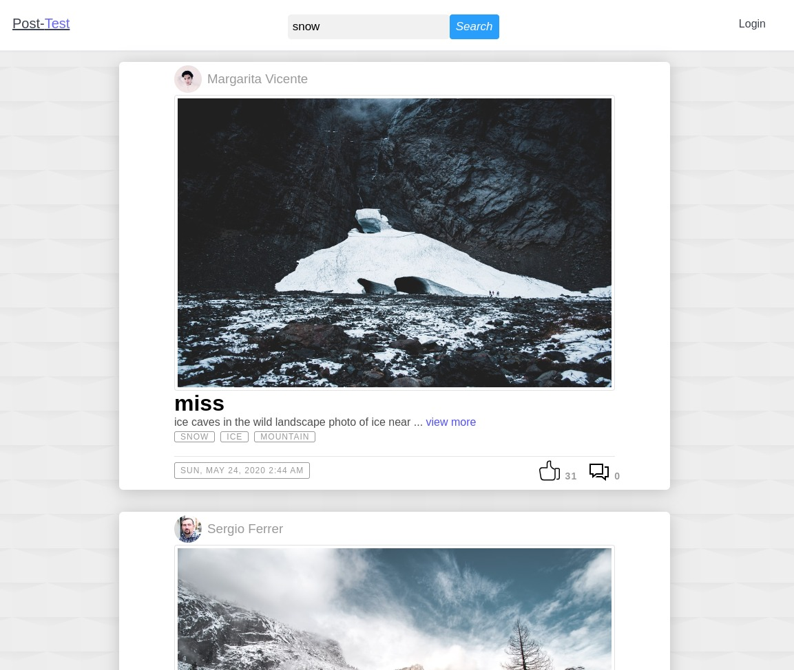
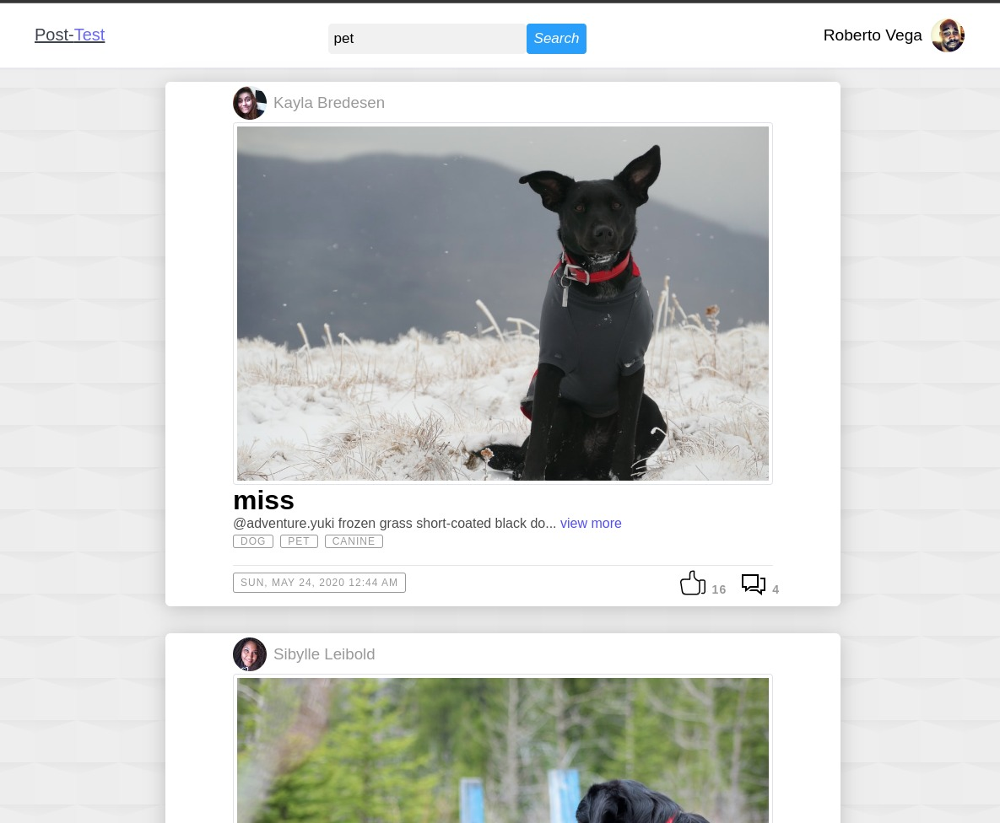
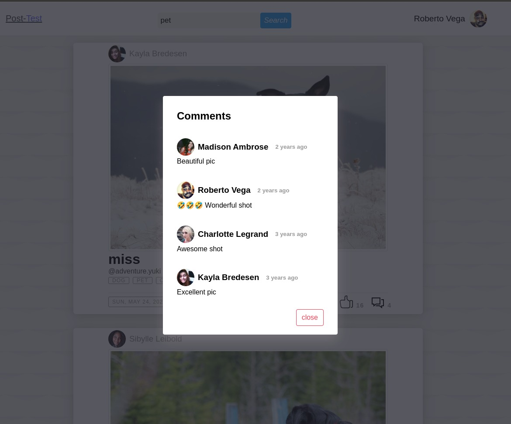
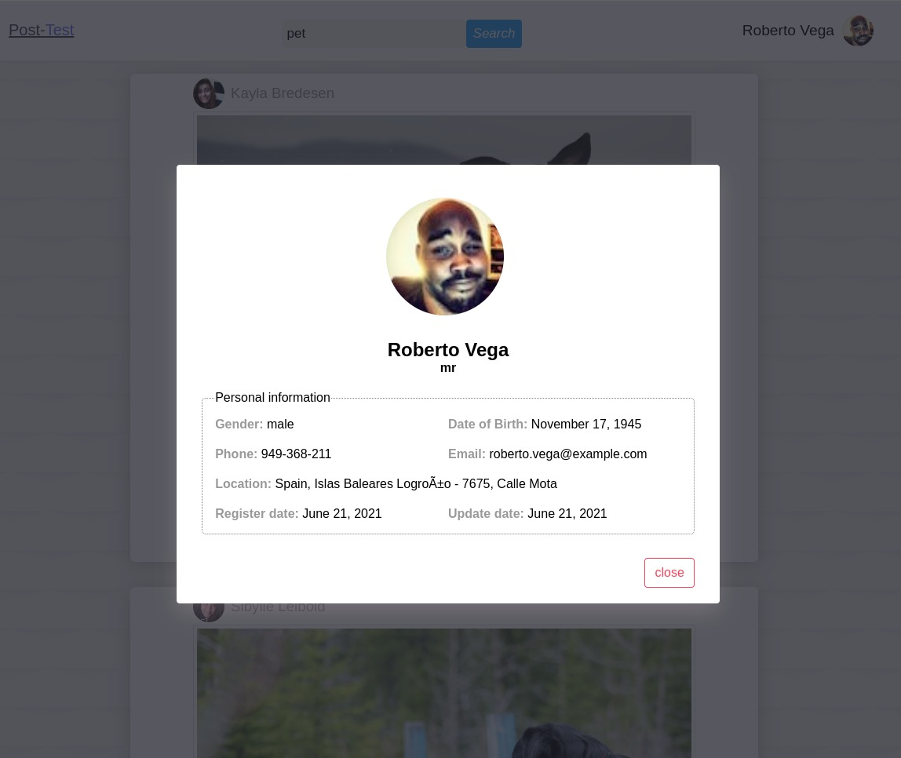
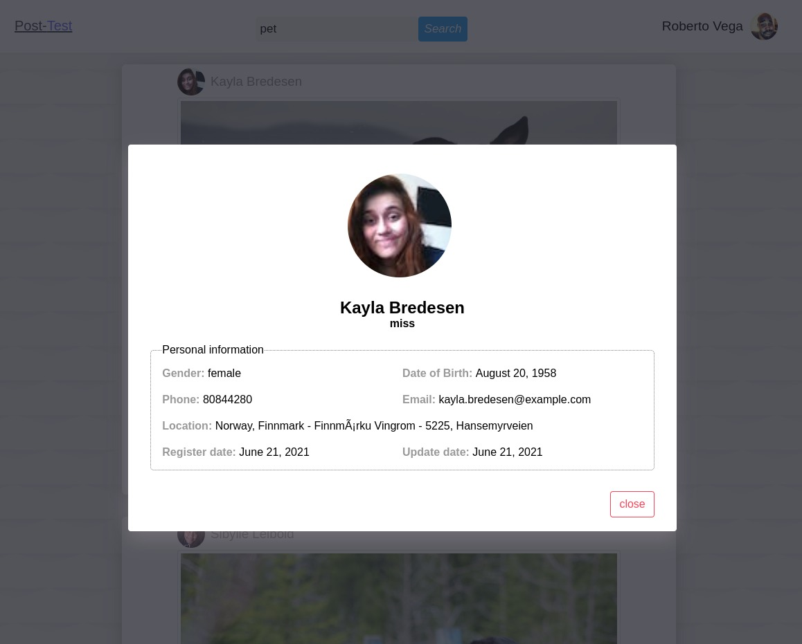
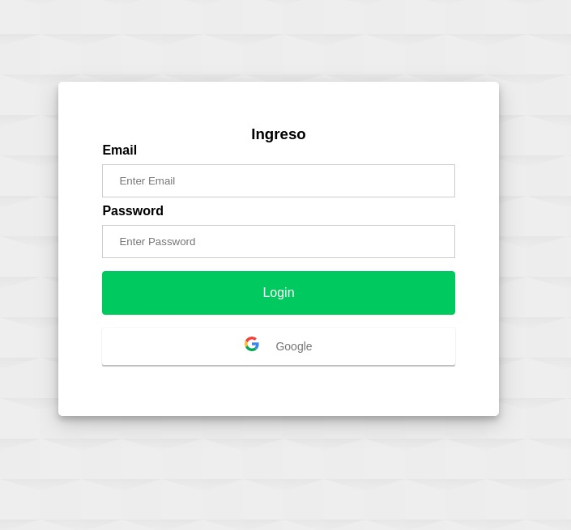
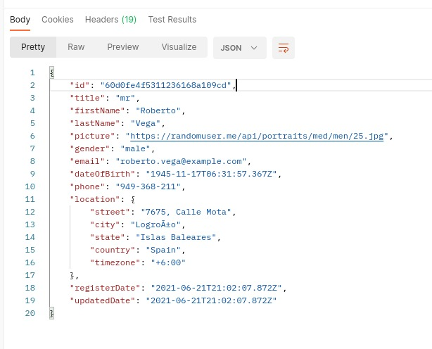

# Post-Test

[Demo Link](https://post--test.herokuapp.com/)

<table>
  <tr>
    <td></td>
     <td></td>
  </tr>
    <tr>
     <td></td>
     <td></td>
   </tr>
  <tr>
     <td></td>
     <td></td>
   </tr>
</table>

# Test

## Login test

|    Email    |   Password  |
|:------------:|:--------:|
|    roberto.vega@example.com  |  60d0fe4f5311236168a109cd  | 
|    carolina.lima@example.com     |  60d0fe4f5311236168a109cf  |
| valentin.ortega@example.com |  60d0fe4f5311236168a109d4  | 


- **user.email:** Email
- **user.id:** Password



# Developer

## Install
```
yarn install
```

## Dev Server
```
yarn dev
```
Default dev server runs at localost:5173 in browser.

## Run ESLint Tests
```
yarn lint-test
```

## Production Bundle
```
yarn build
```

